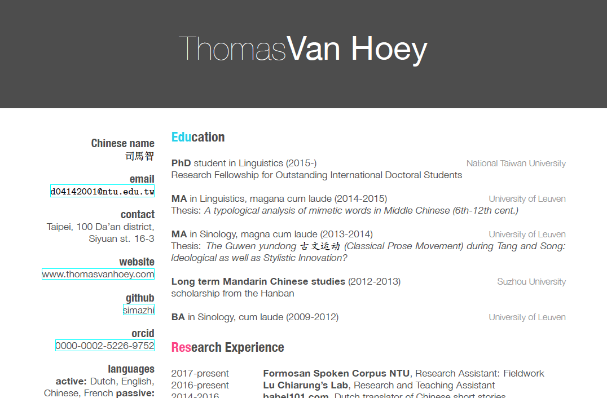

# CV in markdown

The CV template I settled on was adapted from Steven Miller

[Read his blogpost](http://svmiller.com/blog/2016/03/svm-r-markdown-cv/)

[See his github here](https://github.com/svmiller/svm-r-markdown-templates)

# Other templates I tried

The template that was based off [Lucy D'Agostino McGowan's](https://github.com/LucyMcGowan/rmd-cv) rmarkdown adaption of the [Friggeri](https://www.latextemplates.com/template/friggeri-resume-cv) template.

It should look like this:

